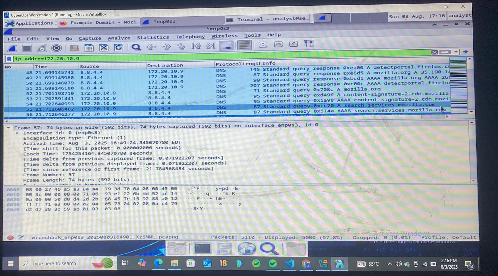
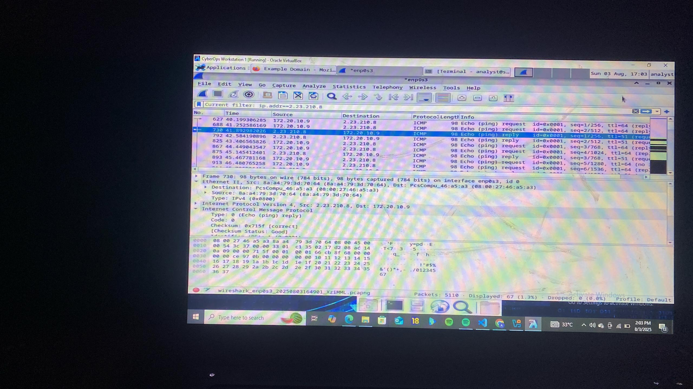

pratice -1 basic packet analysis
date  03/07/2025

**Tools**
    1. cyberops workstation
    2. wireshark
    3. web browser(firefox)
    4. terminal
**site visited**
    www.example.com
    www.google.com

    **Filter Used:** `ip.addr==172.20.10.9`  
**Observation:**
- DNS request made to `8.8.8.8`
- Host queried for:
  - `detectportal.firefox.com`
  - `mozilla.org`
  - `search.services.mozilla.com`
- Response showed `A` and `AAAA` records resolved to IPs.

**Screenshot Reference:**  

## 🔗 TCP 3-Way Handshake (Port 80)

**Filter Used:** `tcp.port==80`  
**Observation:**
- Handshake between `172.20.10.9` and `34.107.221.82`
  - SYN → SYN-ACK → ACK observed
- HTTP GET request to `/success.txt`

**Screenshot Reference:**  

---

## 📶 ICMP Ping

**Filter Used:** `ip.addr==2.23.210.8`  
**Observation:**
- Ping requests from `172.20.10.9` to `2.23.210.8`
- Echo request and reply successfully exchanged
- No packet loss detected

**Screenshot Reference:**  

---

## ✅ Summary

| Protocol | Insight |
|----------|---------|
| DNS      | Resolved web service domains to IPs |
| TCP      | Successfully established handshake |
| ICMP     | Reachability test successful |